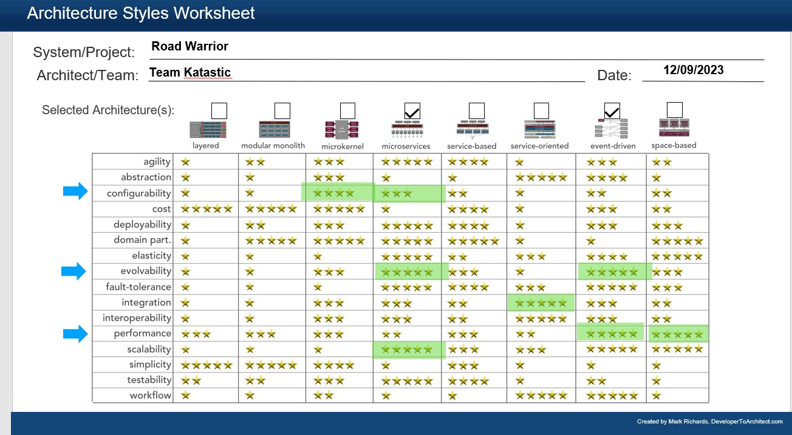
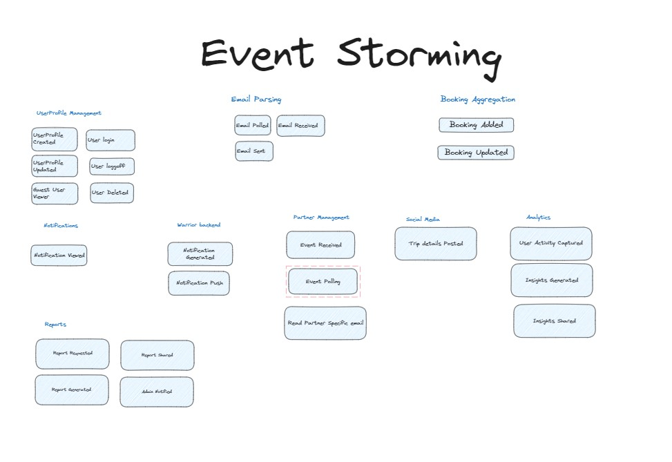
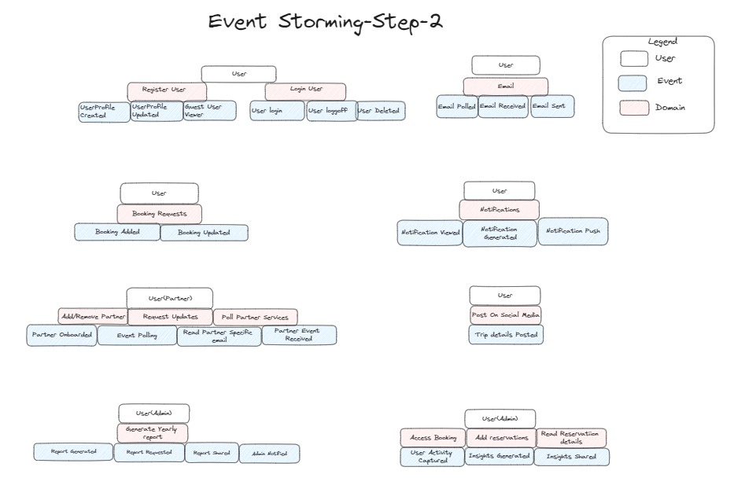
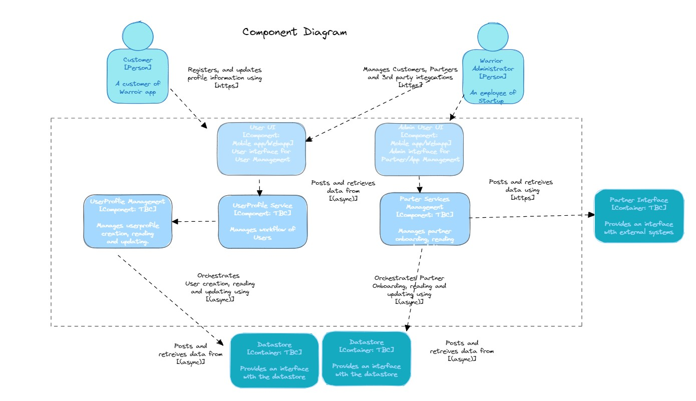
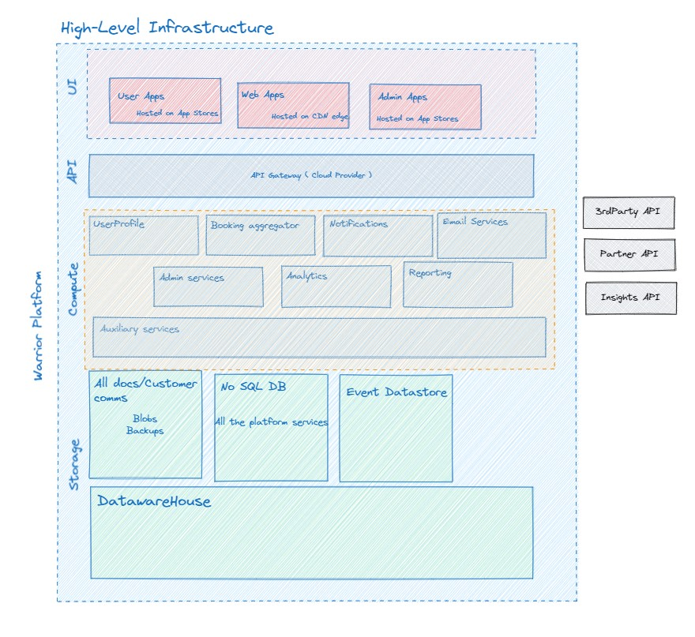

# Katastic
Repo for the Road Warrier - Architecture Katas from Katatic.

Team members : 
- Ali Imtiaz
- Amit Vohra 
- Bhimalkumar Naik 
- Joe Joseph Moonjely 
- Saurabh Chaubey

## Contents
- [Introduction](#introduction) 
- [ProblemBackground](#ProblemBackground)
- [Clarifications](#Clarifications) 
- [Assumptions](#assumptions)
    - [Business Assumptions](#Business-Assumptions)
    - [User Experience Assumptions](#User-Experience-Assumptions)
    - [Technical Assumptions](#Technical-Assumptions)
- [Architecture Characteristics](#architecture-characteristics) 
    - [Driving Characteristics](#driving-characteristics)
    - [Implicit Characteristics](#implicit-characteristics)
    - [Others Considered](#others-considered)
- [Architecture Approach](#architecture-approach)
     - [Architecture Principles](#ArchitecturePrinciples)  
     - [Architecture Patterns](#ArchitecturePatterns)  
- [Context](#context)  
    - [Actors](#actors)    
- [Containers](#containers)
    - [Micro Services](#micro-services)
    - [API Layer](#api-layer)
    - [Events Driven](#events-driven)
- [Components](#components)
    - [Email Parsing Service](#Email-Parsing-Service)
    - [User Management Service](#User-Management-Service)
    - [Booking Aggregation Service](#Booking-Aggregation-Service)
    - [Notification Service](#Notification-Service)
    - [Analytics Service](#Analytics-Service)
    - [Reporting Service](#reporting-service)
 
- [Auxiliary](#Auxiliary-Services)
    - [API Gateway](#API-Gateway)
    - [Event Streaming ](#Event-Streaming)
    - [Data Storage ](#Data-Storage-Service)

- [Deployment](#deployment)
- [Cost Analysis](#cost-analysis)
- [Evaluation, Risks and Architecture Fitness](#evaluation-risks-and-architecture-fitness)  
- [ADRs](#adrs)
- [References](#references)
- [Credits](#Credits)

## Introduction
A new travel dashbaord to revolutionalsie the travel generation.
Our Architecture solution to build the MVP and scale to billions.

## ProblemBackground
A new startup wants to build the next generation online trip management dashboard to allow travelers to see all of their existing reservations organized by trip either online (web) or through their mobile device.

## Clarifications 
https://docs.google.com/document/d/1xHpte5IOjMEBA39211Z3uUwl1p5yXJ7PrCGKUmTmwQE/edit

## Assumptions
### Business Assumptions:
User Behavior: Users will actively use the dashboard to monitor and manage their trips.

Value Proposition: The 5-minute update window is a significant improvement over competitors and will attract users.

Monetization: At some point, there will be revenue models such as premium features or partnerships with travel agencies.

Market Availability: There is a sufficient market of users who are dissatisfied with current trip management solutions and are willing to switch.

Data Sharing: Users are willing to share their email and social media data for the sake of functionality.

### User Experience Assumptions:
Tech-Savvy Users: The users are comfortable using digital dashboards and mobile apps for managing their trips.

Internet Access: Users will have reliable internet access to use the app effectively, especially for real-time updates.

Localization: Initially, the app will be launched in English, with plans for localization in later phases.

Intuitiveness: The app will be intuitive enough for users to understand how to group items by trips, share trips, and so on, without requiring extensive help documentation.

### Technical Assumptions:
Data Consistency: The data fetched from third-party APIs (airlines, hotels, car rentals) is reliable and up-to-date.

Scalability: The system will be able to scale horizontally to support a growing number of users and trips.

Availability: All third-party systems that need to be interfaced with are available and have an uptime close to 100%.

API Limitations: APIs for email polling, travel agencies, and social media allow for real-time or near-real-time data access and are not heavily rate-limited.

Data Privacy: The system will have the necessary security measures to ensure data privacy and comply with regulations like GDPR or CCPA.

Cross-Platform Compatibility: The application will work consistently across all intended mobile and web platforms.

Cloud-Based: The solution will be hosted on a cloud service to ensure high availability and scalability.

## Architecture Characteristics
When architecting the next-generation online trip management dashboard, there are several important architecture characteristics to consider:

### Driving Characteristics

|  Top 3   | Characteristics | Rationale |
| ----------- | ----------- | ----------- |
| - [] | Scalability | At scale the system or certain components of it will need to serve millions of geographically distributed users. Building those components to be able to be horizontally scalable is vital to success |
| - [x] | Performance | The system is required to handle high traffic volumes and complete complex time-sensitive workflows. Performance requirements for certain components need to be enforced by explicit architecture fitness functions |
| - [x] | Availability | The system needs to be availiable at all times, as this will be to got to app for consumers for all the latest updates for the planned trips |
| - [] | Interoperability | System needs to interface with airlines, hotels, and car rentals, so having a well-designed API is crucial. |
| - [x] | Configurability |  As a starup system, its critical to have this chararestic considered early to make sure the time to change is faster and easy as as the platform evolves |
| - [] | Flexibility | Once the system is being used by a critical mass of users, and the affiliate marketing business model is successful, it is very likely we will need to implement new functionality |
| - [] | Usability | The system needs to work well across web and mobile. Design with a responsive or adaptive UI.Keep the user experience smooth and intuitive across all functionalities.|

### Implicit Characteristics
**Security**  
We are transmitting and maintaining user's personal data such as their emails, phone numbers and locations over the web. The data needs to be secured in transit and at rest using appropriate encryption mechanisms. Also, there is need for data de-identification mechanisms and zero-trust verification policies when data needs to be accessed by the development team, admistrative users or other business stakeholders.  
**Cost**  
This app is a startup business. Cost of development, infrastructure requisition and maintenance are implicit concerns

### Others Considered
**Reliability**
While the system is not mission critical, and cost of downtime is high, as the user trust on the bashboard will be impacted and in the long run it will may result in loss of the customer base
**Recoverability**
In case of service downtime, the system needs to be able to recover in a consistent state.

## Architecture Approach

We start by pinpointing the key features that are essential for the system we're building. These key features will guide our design choices.

Next, we'll start by looking at it as a closed box, noting who will interact with it and how. Gradually, we'll open up this box to look at its parts, how they connect, and how they talk to each other.

After that, we'll use event storming to figure out the different sections and elements of our system. This will help us understand how different parts should interact and where they belong.

Lastly, we'll put together the system as a bunch of services that work together. ( ADR TBD ) These services will talk to each other directly or through events. We'll explain these services in a way that doesn't tie us down to any specific tools or technologies.

Establish Ubiquitous Language for clearer understanding and standardisation

- [Architecture Principles](architecturalPhilosophy/ArchitecturePrinciples.md)
- [Architecture Patterns](architecturalPhilosophy/ArchitecturePatterns.md) 

### Architecture characteristics analysis

Architecture Styles Worksheet

*Figure 1 Architecture Styles Worksheet*

#### Performance 
    Based on the nature of the starup and idea of servicing the customers better than current providers performance is a key and essential characteristic to be the diffrentiator 
#### Configurability
    Given the number of partners that need to be integrated to add value and coverage across region this is an critical characteristic for the architecture
#### Evolvability 
    Modularity: The system is divided into modular components, making it easier to modify or replace individual parts without affecting others.
    Loose Coupling: Components interact through well-defined interfaces, allowing for easier replacements or upgrades.
    Plug-and-Play Components: Design with a view to add new features or modules with minimal changes to existing code.
    Open Standards: Use of open standards and protocols to facilitate easier integration and future growth.

### Context 
Context-Actors

*Figure 2 Context Diagram*

#### Actors
##### End-Users
 - Interact with: Web Frontend, Mobile App
##### Warrior Administrators
- Configure new Partners and integrations
- Interact with: Platform for maintenance, Analytics Engine for reports
 

*Figure 3 Event Stroming Diagram*

*Figure 4 Event Stroming Diagram*

### Container

*Figure 5 Container Diagram*

##### Web App
Technology: HTML, CSS, JavaScript (React or Angular)
Responsibility: Displaying the user dashboard, making RESTful API calls to the Backend API.
Communicates with: Backend API

##### Mobile App
Technology: Native Mobile Development (iOS/Android) 
Responsibility: Same as Web Frontend but optimized for mobile.
Communicates with: Backend API, External Social Media APIs for sharing

##### Admin App
Technology: HTML, CSS, JavaScript (React or Angular)
Responsibility: Displaying the Admin console, making RESTful API calls to the Backend API to suppor the Road warrior app
Communicates with: Backend API, External Social Media APIs for sharing

##### API Gateway
Technology: High speed api gatweway using nginix/gateway
Responsibility: Handles apic, communicates with backend apis, apply api policies like rate-limiting, JWT validation,threat protection
Communicates with: All backend services 

##### UserProfile  Service
Technology: Build using Node/Go/java
Responsibility: Backend service for any userprofile operations, Key service which should be highly available and critial
Communicates with: Other Backend services

##### Email Parsing Service
Technology: Serverless Functions or background jobs
Responsibility: Scans and filters emails for travel details.
Communicates with: Backend API, User's Email Provider

##### Booking Aggregation  Service
Technology: Build using Node/Go/java
Responsibility: Brain of the warrior platform. Backend service for any trip realted operations, Key service which should be highly available and critial
Communicates with: Other Backend services

##### Notification Service
Technology: Build using Node/Go/java to interface with external communciation platforms as well as warrior app
Responsibility: Prvode notifications to user
Communicates with: Warrior mobile app. Customer communication apps like Upwire for SMS and email alerts

##### Analytics Service
Technology: Big Data technologies like Hadoop or real-time analytics with Kafka. using external advanced saas platform for Insights
Responsibility: Gathers and analyzes user travel data and other 3rd party data
Communicates with: Backend API of Insights platform

##### Reporting Service
Technology: Using standard reporting using database for users .
Responsibility: Store user profiles, reservations, trips, and analytical data.
Communicates with: Backend API, Analytics Engine

##### Social Media Platforms APIs
Used by: BFF for sharing trip details
Type: External APIs

##### Partner APIs (Airline, Hotel, Car Rental Systems)
Used by: Backend API for pulling and updating reservation details
Type: External APIs User's Email Provider

###  Component-Diagram 

*Figure 6 Component Diagram*
 

### Services
 - [Admin-Service](services/Admin-Service.md)  
 - [Analytics-Service](services/Analytics-Service.md)  
 - [Booking-Aggregation-Service](services/Booking-Aggregation.md)  
 - [Email-Parsing-Service](services/Email-Parsing-Service.md)  
 - [Notification-Service](services/Notification-Service.md)  
 - [Reporting-Service](services/Reporting-Service.md)  
 - [UserProfile-Service](services/UserProfile-Service.md)  

### Systems Architecture

#### Deployment

Infrastructure
 
*Figure 7 Infrastructure Diagram*

## Evaluation, Risks and Architecture Fitness  
This final section is a discussion of how the proposed architecture adheres to the initially chosen driving characteristics, the associated trade-offs and risks. It highlights the areas that must be continuosly be tested and evaluated against benchmarks through fitness functions, ideally as part of the CI/CD pipeline.

*Evaluating the architecture against driving caharacteristics*  
+ Performance - We mitigate network latency related performace issues with effective domain partitioning of data and partner services and avoiding distributed transactions, where possible. Individual services can be tested and benchmarked for perfomance. Using the proposed Caching database for relevent trips can help to better the over all performance

+ Availability - High availability requirements are isolated into stateless microservices. The Booking aggregator service is meant to be the most compute intensive, serving higher trip traffic and processing than others, it is therefore designed to be stateless with no associated persistent data store. Fitness tests for availability will involve running tests against staging clusters with simulated web traffic and partner api updates.

+ Configurability - The use of Microservices lends itself well to an configurable architecture, allowing new components and services to be introduced to serve additional requirements and use cases. However having this 

*Risks*
+ Large volume of trips status tracking could have delays and impact the SLA of processing and notifications, which is the key differntiator. GPU processing capabilties to support this is being explored. Regional instance to customers to support 90% of use cases are being explored.
+ Databases could be a bottleneck to horizontal scalability. Serverless database services/tools, sharding and replication services/tools are possible mitigation strategies
+ Testability of Partner APIs involving multiple services. Tests for individual microservices will also need to include comprehensive cases for distributed workflows.

## ADRs

[ADR00 Buy Vs Build Components](/ADR/ADR00-Buy-vs-Build.md)  
[ADR01 Microservices Architecture](/ADR/ADR01-Microservices-architecture.md)   
[ADR02 Cloud-vs-On-Premise ](/ADR/ADR02-Cloud-vs-On-Premise.md)   
[ADR03 Domain-based Services](/ADR/ADR03-Domain-based-services.md)   
[ADR04 Event-driven Architecture](/ADR/ADR04-Event-driven-architecture.md)   
[ADR05 Portable Technologies](/ADR/ADR05-Portable-technologies.md)   
[ADR06 Caching Service](/ADR/ADR06-Caching-Service.md)   

## References
[C4 Model](https://c4model.com/)  
[Hexagonal Architecture](https://alistair.cockburn.us/hexagonal-architecture/)  
[Fundamentals of Software Architecture](https://learning.oreilly.com/library/view/fundamentals-of-software/9781492043447/)  
[Building Microservices](https://learning.oreilly.com/library/view/building-microservices-2nd/9781492034018/)  
[Building Evolutionary Architectures](https://learning.oreilly.com/library/view/building-evolutionary-architectures/9781491986356/)  
[Building Event-Driven Microservices](https://learning.oreilly.com/library/view/building-event-driven-microservices/9781492057888/)  
[Architecture: The Hard Parts](https://alistair.cockburn.us/hexagonal-architecture/)  
[Documenting Software Architectures Views and Beyond](https://learning.oreilly.com/library/view/documenting-software-architectures/9780132488617/)  
[Previous Kata Entries](https://github.com/tekiegirl/SoftwareArchitectureResources/blob/main/Resources/OReillyKata.md)
[Caching Patterns](https://docs.aws.amazon.com/whitepapers/latest/database-caching-strategies-using-redis/caching-patterns.html)

## Credits
Note: Our work here is inspired by previous winners/participants since this is the first time we have participated in this event.
Lei Zhao / Alok Mishra for reviews
Original comparison matrix from [DeveloperToArchitect.com](https://www.developertoarchitect.com/downloads/worksheets.html)
