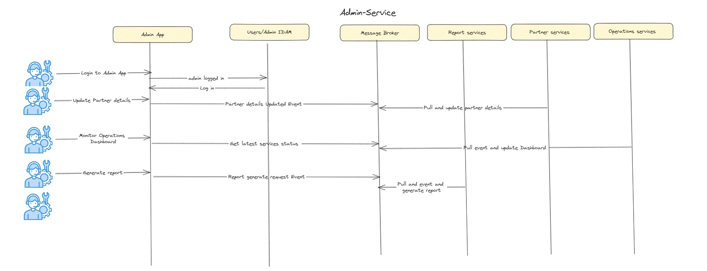

### Description
 Overview
The Admin Services Module serves as the control center for the Warrior Booking Dashboard App. This module enables system administrators to manage and monitor various aspects of the application, from user accounts to data analytics, and from system performance to travel service integrations.

### Key Features
User Management
Create, Edit, and Delete Users: Admins can add new users, update their roles or details, and deactivate accounts.

User Activity Monitoring: Allows admins to track user interactions with the app for auditing or security purposes.

Travel Service Integrations
API Management: Admins can manage the API keys and settings for third-party travel service providers like airlines, hotels, and car rentals.

Data Sync Settings: Allows admins to control the frequency and timing of data synchronization with external services.

System Monitoring
Performance Metrics: Displays real-time information about system performance, including latency, uptime, and error rates.

Alert Settings: Enables admins to set alerts for various performance metrics, which can be sent via email or other notification methods.

Analytics and Reporting
Travel Trends: Generates reports on popular travel destinations, preferred airlines, and hotel chains.

Usage Metrics: Summarizes user engagement, most-used features, and other KPIs in a digestible format.

Email Polling Configuration
Whitelist Management: Allows admins to manage the list of approved email addresses or domains for the email polling service.

Filter Settings: Admins can set rules for identifying travel-related emails from user accounts.

Technical Considerations
The Admin Services Module will have a separate UI accessible only to users with administrator roles.

All operations will be logged to ensure traceability and auditing.

Security measures like two-factor authentication and session timeouts will be implemented to safeguard access.

Communication with Other Modules
Directly communicates with the Backend API for data retrieval and updates.

Can trigger or schedule tasks in the Email Polling Service and Analytics Engine.

By incorporating these features, the Admin Services Module aims to provide a comprehensive toolkit for managing the Travel Booking Dashboard App, enabling system administrators to maintain a smooth and efficient operation.
### Flow Diagram

*Flow Diagram Diagram*
### ADR
 
