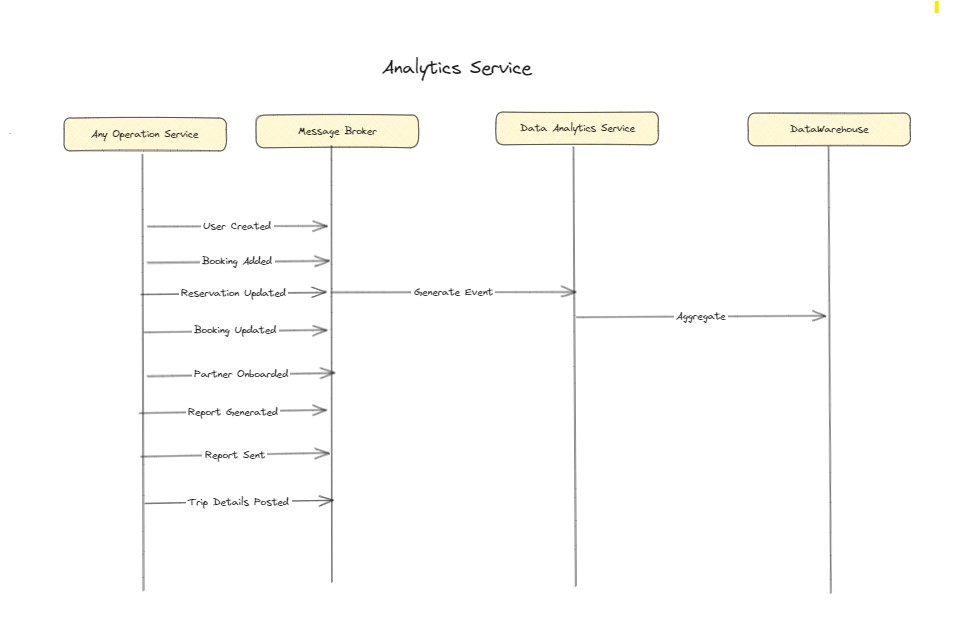

### Description
#### Responsibility:
Data Collection: Aggregates user travel data from various sources including reservations, trip status updates, and user interactions within the app.

Data Analysis: Analyzes the collected data to identify patterns, trends, and key metrics such as preferred airlines, hotel choices, frequency of cancellations, etc.

Third-Party Data Integration: Incorporates data from other third-party platforms or APIs to enrich the analysis, such as weather data, holiday calendars, or global events.

Insights Generation: Utilizes the external advanced SaaS Insights Platform to run complex algorithms on the processed data to generate actionable insights.
Communication:

Backend API: Communicates directly with the Backend API to receive real-time and historical data relevant for analytics.
Insights Platform Module: Interfaces with the Backend API of the external Insights Platform for advanced analysis, which then feeds back into the main app for user consumption as well as strategic decision-making.
#### Key Functions
Real-time Dashboards: Generates real-time dashboards for end-users and administrators, showing the current status of various travel metrics.

Alerts and Notifications: Sends out timely alerts or notifications based on the insights generated, such as travel tips, price drops, or itinerary suggestions.

Reporting: Provides comprehensive end-of-year summary reports with a wide range of metrics about users' travel usage.

Additional Notes:
This Analytics Service acts as a bridge between raw data and actionable insights. It leverages both in-house big data technologies and an external advanced SaaS Insights Platform to deliver a rich, real-time analytics experience that adds value to both users and the business.

### Flow Diagram

*Flow Diagram Diagram*
### ADR

