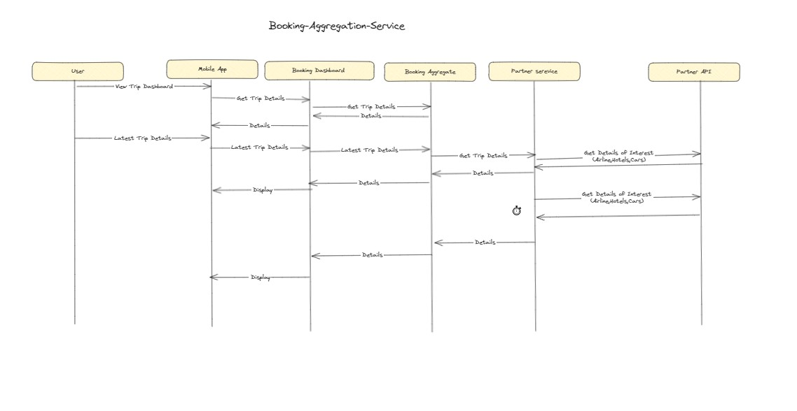

### Description
#### Responsibility:
Core Logic: Serves as the central hub or "brain" of the Warrior platform, responsible for executing all trip-related operations such as booking, updating, or canceling reservations.

High Availability: Given its critical role in the functioning of the platform, this service is designed for high availability to ensure seamless user experience.

Data Aggregation: Gathers information from multiple sources including airlines, hotels, and car rentals to provide a holistic view of available options and current trip statuses.

User Experience: Enhances the user experience by handling complex tasks like grouping bookings by trip, updating trip statuses in real-time, and automatically removing completed trips from the dashboard.

Communication:
Other Backend Services: Interacts with various other backend services for functions like payment processing, analytics, user authentication, and more. This ensures a cohesive and efficient workflow across the platform.
Key Functions:
Booking Management: Handles the entire lifecycle of a booking, from initiation to completion or cancellation.

Real-Time Updates: Keeps track of live updates related to travel details including delays, cancellations, and gate changes.

Error Handling: Includes robust error handling and recovery mechanisms to deal with issues like booking conflicts, payment failures, or data inconsistencies.

User Notifications: Sends timely notifications to users about any updates or changes to their trip, aiming for updates to be reflected in the app within 5 minutes.

Data Synchronization: Ensures that the current status of all bookings is synchronized across the web and mobile interfaces of the Warrior platform.

Additional Notes:
Booking Aggregation Services plays a pivotal role in the Warrior platform, enabling not just bookings but ensuring a reliable and smooth travel experience for users. Given its critical nature, special attention is given to scalability, fault-tolerance, and data integrity to ensure high availability and seamless service.
### Flow Diagram

*Flow Diagram Diagram*
### ADR

